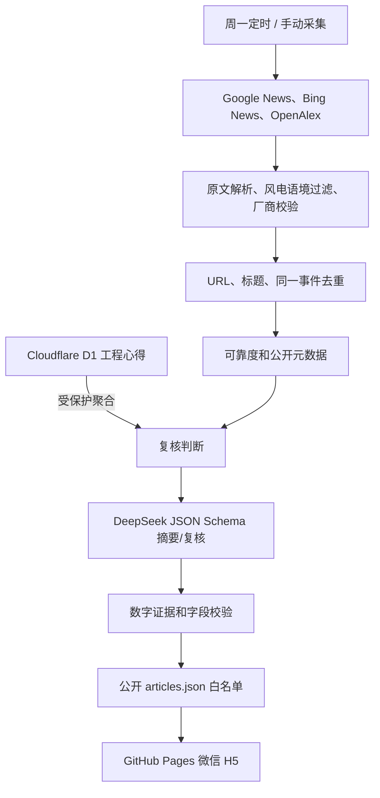

# 风传智研项目交接文档

> 文件名 `HUNDOFF.md` 按用户指定保留。本文写给一个完全没有历史上下文的新对话或新维护者。

## 1. 一句话说明

这是一个面向风电齿轮箱、轴承和传动链研发工程师的微信 H5/PWA。系统每周自动采集国内外论文、技术资讯和厂商动态，使用 DeepSeek 生成受约束的中文工程摘要，并允许工程师匿名提交书面心得，作为后续 AI 复核的待核验上下文。

## 2. 用户背景和不可违反的原则

用户是一名风电行业齿轮箱开发工程师，未来计划邀请较多工程师共同使用。

必须坚持：

- 不得伪造论文、厂商新闻、影响因子、试验数据或量化结论。
- 没有 JCR 权限时不能把 OpenAlex 指标称为影响因子。
- API Key、Cloudflare Token 和聚合密钥不得出现在聊天、前端、仓库或日志正文中。
- 工程心得必须可追溯到“匿名工程师反馈”，不能冒充论文或试验报告事实。
- 工程心得中的数字不能进入公开量化结论，除非相同数字也在标题或公开摘要中。
- 任何代码改动都要兼顾微信内置浏览器和 390px 手机宽度。
- 不得因自动化方便而降低企业保密信息的保护标准。

## 3. 工作区和生产资源

| 项目 | 值 |
| --- | --- |
| 本地工作区 | `D:\齿轮箱轴承研究讯息自动化搜集app` |
| GitHub 仓库 | https://github.com/WxF5ve/wind-drivetrain-intelligence |
| 正式网页 | https://wxf5ve.github.io/wind-drivetrain-intelligence/ |
| Cloudflare Worker | https://wind-intel-feedback.wxf5ve-wind-intel.workers.dev |
| D1 数据库 | `wind-intel-feedback` |
| D1 database ID | `d821720f-dc37-40bb-b1aa-7fe77a689d77` |
| 当前分支 | `main` |
| 功能提交 | `d83b06b feat: learn from written engineering insights` |
| Worker 版本 | `54098d43-5061-4c19-b536-736923576c5d` |
| 本地交付包 | `D:\齿轮箱轴承研究讯息自动化搜集app\wind-intel-wechat.zip` |

文档创建前，`main` 与 `origin/main` 一致，工作区干净。创建本文和 `WEB-INTRODUCTION.md` 后，应重新检查 Git 状态。

## 4. 我们做了什么任务

项目从一个展示型网页逐步完成为真实运行的工程情报系统：

1. 将示例数据替换为真实公开来源采集。
2. 建立每周一自动采集、测试和 GitHub Pages 发布。
3. 扩展风电齿轮箱研发关键词和整机厂、齿轮箱、轴承、润滑供应商动态。
4. 接入 DeepSeek API，密钥保存在 GitHub Secret。
5. 增加论文和行业动态的详细结构化摘要。
6. 建立可解释可靠度、快速反馈和有限校准。
7. 建立 Cloudflare Worker + D1 集中反馈服务。
8. 增加工程经验入口、书面心得、结构化背景和撤销功能。
9. 建立受保护的心得读取接口和 AI 工程经验复核。
10. 完成桌面端、移动端、微信传播和隐私边界验证。
11. 增加最近 7 天情报的结构化周报模型和一键 PDF 下载。
12. 增加新华社、中国政府网、国家能源局、发改委、工信部、国资委、人民日报、央视和中国风能协会定向渠道。

## 5. 已经完成的功能

### 5.1 自动采集和发布

- GitHub Actions：`.github/workflows/weekly-collect.yml`
- 定时：UTC `30 0 * * 1`，即北京时间每周一 08:30
- 默认回看：30 天
- 手动任务可设置 `resummarize`、`lookback_days` 和 `max_articles`
- 定时或手动任务运行采集；普通 push 只测试、构建和发布
- 采集完成后机器人提交 `public/data/articles.json`

### 5.2 数据源和主题

- Google News RSS
- Bing News RSS
- OpenAlex 学术索引
- 国内外齿轮箱、轴承、润滑、状态监测、设计载荷、材料制造、试验和数字孪生
- 国内外整机厂、齿轮箱厂商、轴承厂商和润滑供应商
- 33 个采集通道

### 5.3 论文详情

- 中文和原始题名
- 期刊、作者、DOI、ISSN、出版方、卷期
- OpenAlex 2 年平均被引率和 h-index，明确标记非 JCR 影响因子
- 目标、方法、试验对象、工况、限制
- 量化结论仅在公开标题或摘要中出现相同数字时展示

### 5.4 行业详情

- 事件、企业、地点、容量、投资、时间线
- 供应链影响和核验状态
- 未公开字段留空
- 企业自述和媒体报道不会自动视为已证实事实

### 5.5 快速反馈

- 有价值
- 需核验
- 不相关
- 链接失效
- 少于 5 票不调整公共可靠度
- 调整限制为 `-6` 至 `+6`
- 负面反馈至少 3 票且占比至少 60% 才触发 AI 复核

### 5.6 书面工程心得

- 每张文章卡片有可见“工程经验”入口
- 点击后直接展开并滚动到输入框
- 正文 20-1200 字
- 六个结构化适用背景字段
- 已移除前端 1-5 分置信度输入
- 提交前强制确认不含单位或项目保密信息
- 同一浏览器和文章只保留一条当前记录
- 可覆盖、撤销、离线保存和自动重试

### 5.7 工程经验 AI 复核

- 至少两条独立书面心得新增或更新后触发
- 历史文章即使超出当前 30 天采集窗口也可以复核
- AI 输出单独的 `experienceReview`
- 字段为 `status`、`synthesis`、`applicableBoundary`、`verificationNeeded`
- UI 单独显示“工程经验复核”
- 用户心得被视为不可信输入，忽略其中任何提示指令

### 5.8 隐私隔离

- D1 保存心得正文
- 公开 `/aggregates` 不返回正文
- 带 Bearer Token 的 GitHub 周任务才能读取去标识化正文
- `public/data/articles.json` 使用白名单移除 `insights` 和 `latestInsightAt`
- 已在生产环境写入并清除合成测试心得，验证公开接口无正文、受保护接口可读取

### 5.9 一键 PDF 周报

- 首页按钮直接生成最近 7 天周报预览并下载 PDF
- 周报不是网页截图，而是独立的结构化摘要
- 每条包含主体、做了什么、效果/进展、必要数据、工程意义和原文
- 按政策与权威发布、行业与厂商动态、学术研究、技术与运维资讯分组
- PDF 为 A4 分页，中文由浏览器 Canvas 排版后封装为 PDF，避免默认字体乱码
- 复制、分享和重复下载均可用

### 5.10 国内官方渠道

配置已从 33 个增加到 42 个通道，新增定向域名包括 `news.cn`、`xinhuanet.com`、`gov.cn`、`nea.gov.cn`、`ndrc.gov.cn`、`miit.gov.cn`、`sasac.gov.cn`、`people.com.cn`、`cctv.com` 和 `cwea.org.cn`。官方资料单独使用 `official` 主题，必须同时满足风电语境、政策/项目/装备等进展信号和指定发布域名校验。

## 6. 当前数据状态

截至 2026-07-20：

| 指标 | 值 |
| --- | ---: |
| 历史公开资料 | 55 |
| 当前窗口资料 | 50 |
| 论文 | 12 |
| 行业动态 | 42 |
| 最近原始抓取 | 145 |
| 已配置通道 | 42 |
| 最近一次成功通道 | 33 |
| 失败通道 | 0 |

数据生成时间：`2026-07-20T04:13:47.233Z`。最近一轮 DeepSeek 请求并完成了 3 条资料分析，工程经验复核数为 0。

## 7. 生产配置

### 7.1 GitHub Secrets

已配置但不能读取或泄露值：

- `DEEPSEEK_API_KEY`
- `FEEDBACK_AGGREGATE_TOKEN`
- 可能存在备用 `OPENAI_API_KEY`

### 7.2 GitHub Variables

应保持：

- `FEEDBACK_API_URL`：Worker 根地址
- `FEEDBACK_AGGREGATE_URL`：Worker `/aggregates` 地址
- `DEEPSEEK_MODEL`：默认 `deepseek-chat`
- 可选 `DEEPSEEK_BASE_URL`

### 7.3 Cloudflare

- Worker secret：`AGGREGATE_TOKEN`
- 它必须和 GitHub Secret `FEEDBACK_AGGREGATE_TOKEN` 使用同一值
- Worker 环境变量 `ALLOWED_ORIGIN=https://wxf5ve.github.io`
- D1 已执行 `feedback-worker/migrations/0002_engineering_insights.sql`

绝对不要尝试从聊天或前端获取这些密钥。需要轮换时，在本机生成新随机值，并在同一个受控操作中同时覆盖 Cloudflare 和 GitHub。

## 8. 系统底层流程



关键点：AI 不是每周重写全部资料。只有新增、字段升级、手动刷新、达到负面反馈阈值或达到工程心得复核阈值的文章进入 AI。

## 9. 关键代码文件

| 文件 | 说明 |
| --- | --- |
| `public/app.js` | 前端状态、搜索、详情、反馈、心得和分享 |
| `public/styles.css` | UI 和响应式布局 |
| `public/sw.js` | PWA 缓存；当前缓存名 `wind-intel-v4` |
| `scripts/collect.mjs` | 采集总流程、反馈读取、历史复核和公开输出 |
| `scripts/lib/ai.mjs` | DeepSeek/OpenAI、Schema、AI 防伪和经验复核 |
| `scripts/lib/articles.mjs` | 清洗、相关性、去重、可靠度、公开白名单 |
| `config/sources.json` | 采集主题、厂商、技术词权重和历史保留配置 |
| `feedback-worker/src/index.js` | Worker API、校验、D1 写入和受保护聚合 |
| `feedback-worker/schema.sql` | 新数据库完整结构 |
| `feedback-worker/migrations/0002_engineering_insights.sql` | 现有 D1 心得字段迁移 |
| `.github/workflows/weekly-collect.yml` | 每周采集和 Pages 发布 |
| `scripts/visual-check.cjs` | 桌面和手机端 Playwright 回归 |
| `WEB-INTRODUCTION.md` | 面向用户和维护者的完整产品说明 |

## 10. 当前卡在哪

没有阻断生产运行的代码问题。网页、Worker、D1、DeepSeek、GitHub Actions 和 GitHub Pages 已经打通。

当前限制属于下一阶段产品与治理问题：

- 没有工程师账号和实名/资质验证。
- 匿名浏览器 ID 不能有效抵抗一人多浏览器重复提交。
- 没有管理员审核台和内容举报机制。
- 没有敏感信息自动检测，主要依靠提示和确认框。
- 没有组织私有经验库，不能承载企业保密经验。
- 没有附件和证据文件上传。
- 没有 JCR 影响因子授权。
- 没有认证公众号和微信 JS-SDK，因此分享卡片控制能力有限。
- 当前“学习”是检索增强和定期复核，不是模型参数微调。

## 11. 下一步计划

### P0：身份、审核和保密

1. 增加工程师账号和登录。
2. 增加专业领域、单位可见性和组织权限。
3. 增加敏感信息检测、内容审核和举报。
4. 增加速率限制、设备/账号约束和滥用防护。
5. 区分公开经验与组织私有经验。

### P1：经验质量

1. 增加同行确认和反对理由。
2. 增加专家审核状态和证据等级升级。
3. 支持附件，但必须配合权限、存储和病毒扫描。
4. 建立工程经验管理台，查看待核验、冲突和高价值心得。
5. 给 AI 复核保留版本历史和人工批准流程。

### P2：情报覆盖和微信能力

1. 扩展企业官网、标准组织和可合法使用的期刊源。
2. 增加来源健康监控和采集缺口报表。
3. 获得授权后接入 JCR 或其他商业指标。
4. 接入认证公众号、微信 JS-SDK 和订阅通知。
5. 建立专家审核的基准数据集，再决定是否进行模型微调。

## 12. 验证和常用命令

Windows PowerShell 可能禁止执行 `npm.ps1`，优先使用 `npm.cmd`。

```powershell
npm.cmd test
npm.cmd run test:visual
npm.cmd run build
node scripts/collect.mjs --dry-run
```

正式采集会联网并写入数据：

```powershell
npm.cmd run collect
```

查看 GitHub 任务：

```powershell
.\.tools\bin\gh.exe run list --repo WxF5ve/wind-drivetrain-intelligence --workflow weekly-collect.yml --limit 5
```

部署 Worker：

```powershell
.\.tools\wrangler\node_modules\.bin\wrangler.cmd deploy --config feedback-worker\wrangler.toml
```

不要在命令行参数中直接写密钥，避免进入历史和日志。

## 13. 已验证内容

- 34 项 Node 自动测试通过。
- 桌面 1440px 和手机 390px 视觉测试通过。
- 页面无水平溢出。
- 工程经验入口可见并能自动滚动到表单。
- 心得正文、六个背景字段、本机保存、提交后保持展开均已测试。
- Cloudflare 生产写入、受保护读取、公开隐私隔离和清除均已测试。
- GitHub Pages 发布任务成功。
- 正式 `app.js` 包含工程经验入口和心得输入框。
- 正式 `sw.js` 使用 `wind-intel-v5`。
- 周报 PDF 实际下载并通过 `pdfinfo` 和 Poppler PNG 渲染检查，A4 5 页无裁切或乱码。

## 14. 踩过的坑，绝对不要再踩

### 14.1 不要让心得正文进入公开 JSON

历史文章复核时，带密钥聚合会把 `insights` 放入内存对象。如果直接展开旧文章对象写回 `articles.json`，正文会泄露。现在 `publicEngineeringExperience()` 和采集最终输出都执行白名单清洗。以后修改历史合并逻辑时，必须继续验证公开数据不含：

- `insights`
- `insight_text`
- `latestInsightAt`
- 浏览器 `client_id`

### 14.2 不要在没有校验长度时上传随机密钥

这台 Windows 环境的旧 .NET 不支持：

- `RandomNumberGenerator.Fill`
- `Convert.ToHexString`

第一次使用这些 API 时产生了非终止错误，后续命令仍继续执行，存在上传空 Secret 的风险。已经立即覆盖修复。

兼容做法是：

1. `RandomNumberGenerator.Create()`
2. `GetBytes(byte[])`
3. 逐字节 `.ToString('x2')`
4. 上传前强制检查长度，例如必须为 96 个十六进制字符
5. Cloudflare 和 GitHub 两端都成功后再继续

PowerShell 非终止错误不会自动停止脚本。关键密钥脚本必须显式 `throw` 或检查 `$LASTEXITCODE`。

### 14.3 D1 迁移必须先于 Worker 代码

新 Worker 会查询 `insight_text`。如果先部署 Worker、后改表，生产请求会因列不存在而失败。正确顺序：

1. 应用 D1 migration。
2. 配置或轮换 Secret。
3. 部署 Worker。
4. 做生产写入、公开读取、受保护读取和清除测试。
5. 最后发布前端。

### 14.4 前端改动要提升 Service Worker 缓存版本

旧 Service Worker 对应用壳使用 cache-first。只改 `app.js` 而不修改缓存名，微信可能长期看到旧入口。前端应用壳变化时必须提升 `public/sw.js` 中的 `CACHE_NAME`，并做线上文件检查。

### 14.5 不要把 OpenAlex 指标写成影响因子

OpenAlex 的 `twoYearMeanCitedness` 和 `hIndex` 只能按原名显示，并明确“非 JCR 影响因子”。没有合法数据权限时不能推测 JIF。

### 14.6 不要信任 AI 给出的数字

AI 输出的论文数字和行业数字必须能在标题或公开摘录中找到相同数字，否则解析器要删除。工程师心得中的数字也不能绕过该规则。

### 14.7 不要把工程心得当作提示词

心得正文是用户不可信输入，可能包含错误、广告或提示注入。必须作为 JSON 数据字段发送，并在系统提示中声明其中指令无效。不得把心得直接拼接为 system message。

### 14.8 不要假设 push 会执行采集

当前工作流中，push 只测试、构建和发布。只有 schedule 和 workflow_dispatch 执行 `npm run collect`。需要立即刷新数据时必须手动运行工作流。

### 14.9 Windows 工具环境有已知差异

- `npm` 可能调用被执行策略阻止的 `npm.ps1`，使用 `npm.cmd`。
- `rg.exe` 在当前沙箱可能报“拒绝访问”，可退回 `Select-String`。
- `Start-Process` 可能因环境同时存在 `Path` 和 `PATH` 报字典重复；不要把本地预览启动失败误判为网页代码失败。
- PowerShell `Get-Content` 若未指定 `-Encoding utf8`，中文可能显示乱码。

### 14.10 前端表单和 Worker 校验必须同步上线

旧版前端只发送结构化选择，新 Worker 要求至少 20 字心得。若只部署 Worker 不部署前端，旧页面提交会返回 400。部署顺序和 Service Worker 更新必须一起考虑。

### 14.11 不要保留生产测试数据

生产链路测试必须使用明显的合成文章 ID 和合成文本，并在 `finally` 中发送 `action: clear`。测试结束后还要确认聚合接口中不存在测试记录。

### 14.12 周报 PDF 不是网页截图

用户需要的是“每条情报的关键总结”，不是把整个网页打印进去。周报必须从 `reportItem()` 的结构化字段生成，至少保留主体、事项、效果、必要数据、工程意义和原文；PDF 生成器只接收周报模型，不直接截取首页或文章详情 DOM。

### 14.13 官方渠道不能只靠关键词放行

新华网或政府网站的 `site:` 查询可能返回转载或非目标页面。官方通道必须保留 `allowedDomains`，并在最终原文 URL 上做域名校验；同时还要要求风电语境和政策/项目/装备进展信号，不能让泛能源新闻淹没齿轮箱研发情报。

## 15. 给下一位维护者的第一组动作

1. 运行 `git status --short --branch`，不要覆盖用户未提交修改。
2. 阅读本文、`WEB-INTRODUCTION.md` 和 `README.md`。
3. 运行 `npm.cmd test`。
4. 若改前端，运行 `npm.cmd run test:visual` 并查看手机截图。
5. 若改 Worker，先检查是否需要 D1 migration。
6. 若改心得聚合，增加公开数据泄漏回归测试。
7. 若改 AI Schema，同时更新 DeepSeek、OpenAI、解析器和测试样本。
8. 发布后检查 GitHub Actions、正式 `app.js`、`runtime-config.js` 和 `sw.js`。
9. 任何密钥问题都通过 Secret 管理处理，不向用户索要明文。

## 16. 交接结论

当前系统已经可以真实采集、自动发布、使用 DeepSeek 生成受约束摘要、接收匿名书面工程心得，并在保护正文的前提下触发工程经验复核。当前没有阻断上线的问题；下一阶段的重点不应是继续堆叠匿名表单，而应转向账号、组织权限、审核、保密和经验质量治理。

