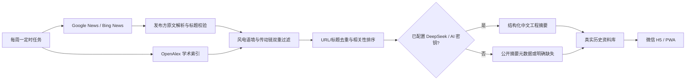

# 风传智研

面向风电齿轮箱、轴承和传动链研发工程师的每周行业情报 PWA。应用可以直接通过微信中的 HTTPS 链接打开，也支持添加到手机桌面。

## 已实现

- 每周简报：汇总资料数量、国内外分布、论文数量和关键信号
- 全文搜索：同时检索标题、摘要、标签、来源和关键结论
- 分类与筛选：齿轮箱、轴承、状态监测、润滑、论文、国内/海外
- 工程摘要：概述、三条关键信息、工程启示和原文链接
- 本机收藏与关注关键词
- 系统分享；不支持系统分享时自动复制微信可用链接
- PWA 离线壳与移动端底部导航
- Google News/Bing News 新闻索引、OpenAlex 学术索引和相关性过滤
- 发布方原文 URL 解析、页面标题一致性校验和公开摘要元数据提取
- 可解释可靠度评分：来源、证据、原文、交叉印证、声明风险和有限用户反馈修正
- 用户反馈与个性化推荐：有价值、需核验、不相关、链接失效
- DeepSeek 结构化中文摘要与反馈触发复核，未配置密钥时使用公开摘要
- GitHub Actions 每周一 08:30（北京时间）自动刷新并发布

`public/data/articles.json` 已由真实网络采集生成。生产数据会明确标记 `dataMode: live`、采集通道、采集时间和原文链接类型；演示数据不会进入正式资料库。

可靠度分数用于提示核验优先级，不等同于事实已经证实。少于 5 份的用户反馈不会修改公共可靠度；达到阈值后最多只允许 `-6` 至 `+6` 分修正，避免少数点击覆盖来源与证据判断。

## 本地运行

Node.js 20 或更高版本即可：

```powershell
npm install
node server.mjs
```

打开 `http://localhost:4173`。

运行单元测试：

```powershell
node --test
```

运行桌面和手机视觉回归测试（电脑需安装 Chrome 或 Edge）：

```powershell
npm run test:visual
```

## 采集与摘要

只联网检查结果、不写入数据文件：

```powershell
node scripts/collect.mjs --dry-run
```

正式刷新：

```powershell
node scripts/collect.mjs
```

生成可部署的微信 H5：

```powershell
npm run build
```

部署目录为 `dist`。设置 `PUBLIC_BASE_URL` 后构建，会自动写入微信分享卡片所需的绝对封面地址。

推荐使用 DeepSeek 官方 API。Key 只放在本机环境变量或 GitHub Repository secret `DEEPSEEK_API_KEY`，不会进入网页和资料文件。

```powershell
$env:AI_PROVIDER="deepseek"
$env:DEEPSEEK_API_KEY="..."
$env:DEEPSEEK_MODEL="deepseek-chat"
node scripts/collect.mjs
```

首次需要重新生成采集窗口内已有资料的摘要时运行 `npm run collect:resummarize`。后续每周只分析新增资料；达到最小反馈量且“需核验/不相关”占比达到阈值的资料会进入 AI 复核。模型输出必须通过 JSON 结构校验，调用失败时继续使用发布方公开摘要。

OpenAI 仍可作为备用供应商：设置 `AI_PROVIDER=openai`、`OPENAI_API_KEY` 和 `OPENAI_MODEL`。不要把任何 API Key 写入前端或提交到仓库。

## 数据流程



采集器只保存标题、来源、短摘要、标签和原文链接，不镜像原文全文。正式运营时仍需定期检查数据源条款、链接有效性和自动摘要准确性。

## 微信发布

1. 将 `dist` 目录部署到支持 HTTPS 的静态托管服务。
2. 将公开链接发送到微信即可打开；页面已适配常见手机宽度。
3. 如需定制微信好友/朋友圈分享卡片、统计用户或发送订阅通知，需要继续接入公众号或小程序的身份与分享能力。
4. 面向中国大陆长期公开运营时，应根据实际服务器位置、域名和业务形态完成相应备案与合规检查。

静态站可以部署到 Cloudflare Pages、Vercel、GitHub Pages 或企业自己的 Web 服务。每周工作流提交新数据后，托管平台可自动重新发布。

完整的一次性上线步骤见 [DEPLOY-WECHAT.md](DEPLOY-WECHAT.md)。

集中反馈服务位于 `feedback-worker`。未配置服务时，反馈只保存在当前浏览器并用于本机个性化排序；配置后会匿名汇总到每周可靠度校准流程。

## 关键文件

- `public/index.html`：应用页面结构
- `public/app.js`：搜索、筛选、收藏、分享和详情交互
- `public/styles.css`：桌面与移动端样式
- `scripts/collect.mjs`：新闻、论文采集、备用 RSS 与摘要
- `config/sources.json`：关键词、数据通道和相关性权重
- `.github/workflows/weekly-collect.yml`：每周一自动任务
- `scripts/build.mjs`：生成带微信分享元信息的部署目录
- `feedback-worker`：匿名结构化反馈与聚合服务
