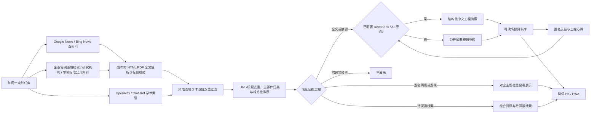

# 机械中心-传动技术部在线平台

面向机械中心传动技术部及风电研发工程师的每周行业情报 PWA。应用可以直接通过微信中的 HTTPS 链接打开，也支持添加到手机桌面。

## 已实现

- 每周简报：汇总资料数量、国内外分布、论文数量和关键信号
- 全文搜索：同时检索标题、摘要、标签、来源和关键结论
- 五个突出主栏目：传动链技术开发与质量运维、论文标准与专利、厂商与项目动态、政策市场与产业环境、综合资讯与待深读线索
- 主题分类与信息层级分离：全文/摘要以完整卡片展示；含明确事件的题名简讯和论文/标准/专利题录回到对应主栏目紧凑展示；信息不足的综合线索进入待深读栏目；招聘等噪声不展示
- 传动链部件归类：每条专业资料使用一个主部件和多个关联部件；覆盖传动链总体、齿轮箱总成、主轴系统、行星级、平行轴级、齿轮件、齿轮箱轴承、滑动轴承、箱体支承、轴系连接、润滑冷却密封、制动高速端和监测传感
- 精准多维标签：具体零件、技术领域、精确技术、失效模式、开发阶段和证据类型彼此独立，避免把来源、部件和研究主题混成一个标签
- 工程摘要：概述、三条关键信息、工程启示和原文链接
- 论文详情：中文题名、作者、DOI、ISSN、卷期、OpenAlex 公开期刊指标、研究设计和量化结论
- 行业详情：事件、企业、容量/金额、时间线、供应链影响和核验状态
- 本机收藏与关注关键词
- 系统分享；不支持系统分享时自动复制微信可用链接
- PWA 离线壳与移动端底部导航
- Google News/Bing News 双索引、OpenAlex/Crossref 学术索引、国内公开题录入口和相关性过滤
- 发布方原文 URL 解析、页面标题一致性校验；公开 HTML/PDF 全文优先，无法获取时回退摘要或元数据
- 可解释可靠度评分：来源、证据、原文、交叉印证、声明风险和有限用户反馈修正
- 用户反馈与个性化推荐：有价值、需核验、不相关、链接失效
- 匿名工程心得：正文、适用性、部件、失效模式、证据等级、功率区间和场景
- AI 工程经验复核：归纳心得中的共识、适用边界、冲突与待验证问题
- DeepSeek 结构化中文摘要与反馈触发复核，未配置密钥时使用公开摘要
- 102 个新闻、官网、官方、企业、论文、专利、标准和国内公开题录通道；企业官网按单域名检索并再次校验最终原文域名，覆盖 CWEA、国内外齿轮箱/轴承企业、整机厂和 NREL/OSTI/Sandia/DNV
- 渠道健康状态区分请求成功、有效产出、本期空结果、连续低产和请求失败；不再把 `ok + 0 条`计作有效覆盖
- GitHub Actions 每周一 08:30（北京时间）自动刷新并发布，11:15 执行同日去重的兜底检查

`public/data/articles.json` 已由真实网络采集生成。生产数据会明确标记 `dataMode: live`、采集通道、采集时间和原文链接类型；演示数据不会进入正式资料库。

可靠度分数用于提示核验优先级，不等同于事实已经证实。少于 5 份的用户反馈不会修改公共可靠度；达到阈值后最多只允许 `-6` 至 `+6` 分修正，避免少数点击覆盖来源与证据判断。

项目没有 JCR 授权，不展示或推测 Journal Impact Factor。页面使用 OpenAlex 的“2 年平均被引率”和 h-index，并明确标注其不是 JCR 影响因子。AI 提取的量化结论只有在标题或公开摘要中能核对到相同数值时才会展示。

## 本地运行

Node.js 20 或更高版本即可：

```powershell
npm install
node server.mjs
```

打开 `http://localhost:4173`。

运行单元测试：

```powershell
node --test
```

运行桌面和手机视觉回归测试（电脑需安装 Chrome 或 Edge）：

```powershell
npm run test:visual
```

## 采集与摘要

只联网检查结果、不写入数据文件：

```powershell
node scripts/collect.mjs --dry-run
```

只探测指定渠道并打印少量样例、不写入数据文件：

```powershell
node scripts/collect.mjs --probe-sources=web-global-bearing-suppliers,web-global-wind-oems
```

正式刷新：

```powershell
node scripts/collect.mjs
```

生成可部署的微信 H5：

```powershell
npm run build
```

部署目录为 `dist`。设置 `PUBLIC_BASE_URL` 后构建，会自动写入微信分享卡片所需的绝对封面地址。

推荐使用 DeepSeek 官方 API。Key 只放在本机环境变量或 GitHub Repository secret `DEEPSEEK_API_KEY`，不会进入网页和资料文件。

```powershell
$env:AI_PROVIDER="deepseek"
$env:DEEPSEEK_API_KEY="..."
$env:DEEPSEEK_MODEL="deepseek-chat"
node scripts/collect.mjs
```

首次需要重新生成采集窗口内已有资料的摘要时运行 `npm run collect:resummarize`。后续每周只分析新增资料；达到最小反馈量且“需核验/不相关”占比达到阈值的资料会进入 AI 复核。模型输出必须通过 JSON 结构校验，调用失败时继续使用发布方公开摘要。

OpenAI 仍可作为备用供应商：设置 `AI_PROVIDER=openai`、`OPENAI_API_KEY` 和 `OPENAI_MODEL`。不要把任何 API Key 写入前端或提交到仓库。

## 数据流程


```mermaid
flowchart LR
    A["每周一定时任务"] --> B["Google News / Bing News 双索引"]
    A --> C["OpenAlex / Crossref 学术索引"]
    A --> W["企业官网逐域检索 / 研究机构 / 专利标准公开索引"]
    B --> D["发布方 HTML/PDF 全文解析与标题校验"]
    D --> E["风电语境与传动链双重过滤"]
    C --> E
    W --> D
    E --> F["URL/标题去重、主部件归类与相关性排序"]
    F --> Q{"信息证据层级"}
    Q -- "全文或摘要" --> G{"已配置 DeepSeek / AI 密钥?"}
    Q -- "题名简讯或题录" --> T["对应主题栏目紧凑展示"]
    Q -- "待深读线索" --> M["综合资讯与待深读线索"]
    Q -- "招聘等噪声" --> X["不展示"]
    G -- "是" --> H["结构化中文工程摘要"]
    G -- "否" --> I["公开摘要规则整理"]
    H --> J["可读情报资料库"]
    I --> J
    J --> L["匿名反馈与工程心得"]
    L --> G
    J --> K["微信 H5 / PWA"]
    T --> K
    M --> K
```

采集器只在摘要阶段临时读取合法公开的正文，公开数据文件只保存结构化摘要、技术标签、提取状态和原文链接，不镜像原文全文。正式运营时仍需定期检查数据源条款、链接有效性和自动摘要准确性。

## 微信发布

1. 将 `dist` 目录部署到支持 HTTPS 的静态托管服务。
2. 将公开链接发送到微信即可打开；页面已适配常见手机宽度。
3. 如需定制微信好友/朋友圈分享卡片、统计用户或发送订阅通知，需要继续接入公众号或小程序的身份与分享能力。
4. 面向中国大陆长期公开运营时，应根据实际服务器位置、域名和业务形态完成相应备案与合规检查。

静态站可以部署到 Cloudflare Pages、Vercel、GitHub Pages 或企业自己的 Web 服务。每周工作流提交新数据后，托管平台可自动重新发布。

完整的一次性上线步骤见 [DEPLOY-WECHAT.md](DEPLOY-WECHAT.md)。

集中反馈服务位于 `feedback-worker`。未配置服务时，反馈和心得只保存在当前浏览器；配置后，工程师可提交 20-1200 字心得及结构化适用背景。公开接口和网页数据只保留数量，不包含心得原文；每周采集任务使用单独密钥读取正文。至少两条独立心得新增或更新后才触发 DeepSeek 复核，单条留言不能直接改写公开结论。AI 归纳始终标记为待核验工程经验，不替代论文、试验报告或失效分析证据。

## 关键文件

- `public/index.html`：应用页面结构
- `public/app.js`：搜索、筛选、收藏、分享和详情交互
- `public/styles.css`：桌面与移动端样式
- `scripts/collect.mjs`：新闻、论文采集、备用 RSS 与摘要
- `scripts/migrate-taxonomy.mjs`：将历史资料迁移到当前唯一主栏目与多维标签体系
- `config/sources.json`：关键词、数据通道和相关性权重
- `.github/workflows/weekly-collect.yml`：每周一自动任务
- `scripts/build.mjs`：生成带微信分享元信息的部署目录
- `feedback-worker`：匿名反馈、工程心得与受保护聚合服务
